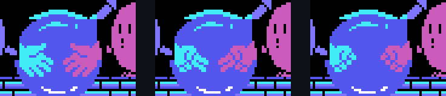
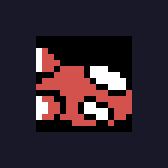

# Findings

Each one says where it comes from: the code, a ROM table or a test in openMSX.
The tests are in `tools/pruebas/` and are told in
[In the emulator](IN-THE-EMULATOR.md).

## Five in a row, not the whole pyramid

A stage is not cleared by finishing every cube but by having **five finished
in a row** in a row, column or diagonal of the 9 × 9 grid (`0x7421`). One
routine per frame, in turn, counts the rows (`0x7330`), the columns
(`0x7353`) and both diagonals (`0x7369`, `0x737D`), and on each four-frame round
it counts one player's cubes: the mask of the `and` in the three-byte routine
the game writes at `0xE4FD` switches from 0x40 to 0x20.

The fourth check decides: one line is enough up to stage 30, two are needed
from 31 to 40 and three from 41 to 50 (`0x7391`-`0x73A6`).

*Tested in openMSX*: with five cubes on row 4 of stage 1 marked as finished,
the game moves to the stage-cleared step and pays the time.

## The cubes roll

`0x72C0` is 24 rows of four bytes: the rotation each of the 24 turns into when
jumped on in each of the four diagonals. They are the 24 rotations of a cube:
every column is a permutation, and any rotation is reachable from any other in
**four jumps at most** (measured walking the table; `tests/test_juego.py`
checks it).

A cube is finished when its three visible faces match the model's
(`0x722F`), so finishing one means planning the route of jumps.

## Rock, paper, scissors

In the duel, if time runs out with equal cubes, or if both fall, JAN-KEN-PON is
played (`0x89C6`): LET'S PLAY JAN-KEN, each one picks with their joystick (down
paper, left scissors, up rock, `0x8B2B`) and the next hand beats the previous
one: scissors beat paper, rock beats scissors, paper beats rock (`0x8A89`).
Without a press, each gets one at random.

The right-hand hands are the left-hand ones mirrored: `0x8C5F` copies 45 tiles
from VRAM to VRAM reversing every byte.

## The hidden life

`0x9093` records the result of the last three jumps: 1 if it finished a cube,
0 if it rotated one without finishing it, 0x40 if it landed on one already
finished. With three ones in a row, fewer than 8 lives and one player, an
object appears once at Q\*bert's height and crosses from left to right one pixel
per frame (`0x8FDF`), and touching it gives a life with the extra-life sound.

*Tested in openMSX*: with the streak set by hand, the object appears at
Q\*bert's Y, crosses, and the lives go from 2 to 3.

## F5 and F1

In scene 7 row 7 of the keyboard is read: **F5** sets the score to zero, three
lives and goes back to the same stage (`0x4396`). **F1** pauses and unpauses,
but only while the stage tunes are playing (`0x6AA3`).

*Tested in openMSX*: the CONTINUE goes back to the game on stage 1 with two
lives in reserve; the pause keeps the time still until the second F1.

## The bonus stage

After stages 3, 6 and 10 of every ten (`0x79AE`, on the units of the stage
minus one) bit 0 of the mode turns on, the board at `0xA7AD` is loaded and the
game runs another step (`0x789D`): the screen is uncovered top to bottom,
Q\*bert stays on each cube and the diagonals rotate it (`0x7A37`); when it is
finished he moves on (`0x7A47`). At the end they are counted: every finished
cube is covered with its points, 100 the first, 200 the second… and with all
27 comes PERFECT 5000 POINT.

*Tested in openMSX*: after stage 3 the bonus stage starts. The PERFECT comes
from the code.

## Fifteen objects

Objects 4 to 18 each come out in their own time (`0x7444`: every 64 frames
their wait drops, and after coming out it goes back to 15) onto one of the two
top cubes. What each one does is dispatched by `0x7628`: the green ball freezes
for 128 counts of four frames, the grey one makes everyone run away, the red
one gives the long jump, the yellow one and the turtle change the speed, the
blue one gives invincibility and the cube spinner gives 100 points. The eight
that kill are the moai, the hooded one and the six coloured ones, which stick to
cubes whose top face is their colour (`0x750D`). The hooded one heads for
Q\*bert (`0x7559`), and if it lands on a spinning cube it falls and gives 1,000
points (`0x6E99`).

It comes from the code; the drawings, from the ROM.

## The green ball writes into the BIOS

`0x7763` is `ld hl,000BCh` and then `0x6E2F` writes to `(hl)` and `(hl-2)`:
0x00BC and 0x00BA are the BIOS ROM and nothing happens. The same code with
`0xE2BC` would remove object 23. It is a reasoned assumption: the high byte was
lost.

## Konami's mark

The last ten bytes: the title in katakana backwards (キューバート), its length,
the 0x46 of RC-746 and 0xAA. Nobody reads them.
