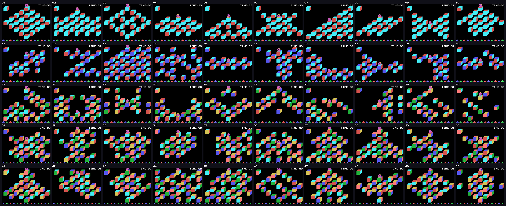
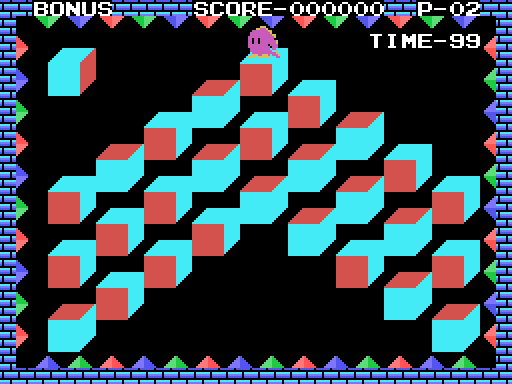
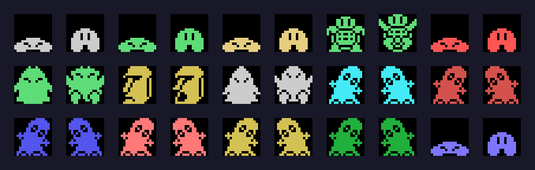
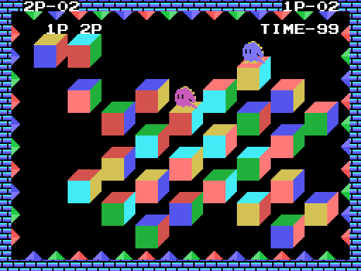

# The game

Q\*bert hops from cube to cube down a pyramid seen in perspective. In this MSX
version the cubes do not change colour: they **roll**, and a stage is cleared
when there are **five finished cubes in a row**.

## The board

Each stage is a 9 × 9 grid (`0x97DB`, 81 bytes per stage). A cell is `0xFF` if
there is no cube, or the number of one of the **24 rotations** of a cube with
painted faces. The cubes sit every three columns and every two rows, so on
screen they make a pyramid, a diamond, an X or whatever the stage says.

Cell 0, at the top left, is the **model**: the cube as the others must be left.
A cube is finished when it shows the same three faces as the model (the top one
and the two sides, `0x722F`); then it is drawn as a finished cube.

There are three cube styles (`0xA7FE`): one for stages 1 to 10, another for 11
to 20 and another for 21 to 50.

## The jumps

Q\*bert only jumps diagonally: two directions must be held together (up-left,
up-right, down-left or down-right, `0x6C90`). Each jump goes up or down a row
and across a column. On landing, the cube underneath **rolls** in the direction
of the jump (`0x72C0`): the same direction from the same rotation always gives
the same new rotation, and any rotation is reachable from any other in four
jumps at most.

Jumping off the pyramid, or onto the model cells, is a fall.

## How a stage ends

With **five finished cubes in a row** in a row, column or diagonal of the grid;
empty cells do not break the line (`0x7421`). One line is needed up to stage 30,
two from 31 to 40 and three from 41 to 50 (`0x737D`). Not every cube has to be
finished.

When it is cleared, Q\*bert hops six times, the frame changes colour and the
remaining time is paid at 10 points a second.

## Time, lives and points

- **Time** starts at 99 and drops one every 64 frames (`0x7829`); below 10 the
  warning sounds. At zero, TIME OVER.
- **Lives**: three. The `P-` counter shows the ones in reserve. There is an
  extra life at 10,000 points, at 60,000, at 110,000… (the threshold goes up 5
  in the high byte of the score, `0x450D`), and a hidden life (see
  [Findings](FINDINGS.md)).
- **Points**: 300 per finished cube, 100 per object taken, 1,000 if the chaser
  lands on a spinning cube, 10 per second left over and 5,000 for the bonus
  PERFECT.

At GAME OVER, **F5** is the CONTINUE: the same stage with three lives and the
score at zero. **F1** pauses while the stage music is playing.

## The levels

The menu offers LEVEL 1 to LEVEL 5: you start on stage 1, 11, 21, 31 or 41
(`0x65E3`). After stage 50 comes stage 1 again.

After stages 3, 6 and 10 of every ten comes the **bonus stage**: Q\*bert stays
on each cube, the diagonals rotate it and when it is finished he moves to the
next one; at the end each finished cube is worth 100, 200, 300… and with all
27, PERFECT 5000 POINT (`0x789D`).

## The objects

Fifteen objects fall down the pyramid (`0x6456`), each with its wait and
depending on the difficulty (`0x64DB`):

| object | drawing | what it does when touched |
|---|---|---|
| 4 | grey ball | the creatures run away |
| 5 | green ball | everything but the Q\*berts freezes for a while |
| 6 | yellow ball | one more jump step per frame: faster |
| 7 | turtle | one step fewer |
| 8 | red ball | the long jump (two rows, with the trigger) and Q\*bert in white |
| 9 | the cube spinner | 100 points; while it walks it rotates the cubes it leaves |
| 10 | moai | kills; bounces down |
| 11 | hooded one | kills; chases Q\*bert |
| 12-17 | six coloured creatures | kill; stay on cubes whose top face is their colour |
| 18 | blue ball | invincibility: the killers fall when touched |

## Two players

With 2PLAYERS both play **at once**, each with their own model (cells 0 and 1,
with 1P and 2P above them). The second one uses joystick 2 or the keys E, S, F,
C and CTRL. The match is 3 or 5 sets (`0xECB8`), on random stages from 31 to
50. A set goes to the first one to make a line; if time runs out, to whoever
has more cubes; and with a tie, or if both fall with no lives left, it is
settled by rock, paper, scissors.

## The demo

Two alternate: one player on stage 34 and two at once on stage 37, with the
recorded presses at `0x6BBF` and `0x6BD8`.
