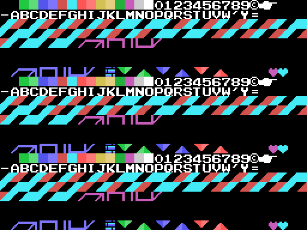

# Hallazgos

Cada uno dice de dónde sale: del código, de una tabla de la ROM o de una
prueba en openMSX. Las pruebas están en `tools/pruebas/` y se cuentan en
[En el emulador](EN-EL-EMULADOR.md).

## Cinco en línea, no la pirámide entera

La fase no se acaba al acabar todos los cubos sino al tener **cinco acabados
seguidos** en una fila, columna o diagonal de la cuadrícula de 9 × 9
(`0x7421`). Una rutina por cuadro, por turnos, cuenta las filas (`0x7330`), las
columnas (`0x7353`) y las dos diagonales (`0x7369`, `0x737D`), y en cada vuelta
de cuatro cuadros cuenta los cubos de un jugador: la máscara del `and` de la
rutina de tres bytes que el juego escribe en `0xE4FD` pasa de 0x40 a 0x20.

La cuarta comprobación decide: una línea basta hasta la fase 30, hacen falta
dos de la 31 a la 40 y tres de la 41 a la 50 (`0x7391`-`0x73A6`).

*Probado en openMSX*: con cinco cubos de la fila 4 de la fase 1 marcados como
acabados, el juego pasa al paso de fase acabada y cobra el tiempo.

## Los cubos ruedan

`0x72C0` son 24 filas de cuatro bytes: el giro en el que se convierte cada uno
de los 24 al saltarle encima en cada una de las cuatro diagonales. Son los 24
giros de un cubo: cada columna es una permutación, y cualquier giro se alcanza
desde cualquier otro en **cuatro saltos como mucho** (medido recorriendo la
tabla; lo comprueba `tests/test_juego.py`).

Un cubo está acabado cuando sus tres caras visibles coinciden con las del
modelo (`0x722F`), así que para acabar uno hay que planear la ruta de saltos.

## Piedra, papel o tijera

En el duelo, si se acaba el tiempo con los mismos cubos, o si caen los dos, se
juega a JAN-KEN-PON (`0x89C6`): LET'S PLAY JAN-KEN, cada uno elige con su mando
(abajo papel, izquierda tijera, arriba piedra, `0x8B2B`) y la mano siguiente
gana a la anterior: tijera a papel, piedra a tijera, papel a piedra
(`0x8A89`). Sin pulsar, a cada uno le toca una al azar.

Las manos de la derecha son las de la izquierda reflejadas: `0x8C5F` copia 45
tiles de la VRAM a la VRAM dándole la vuelta a cada byte.

## La vida escondida

`0x9093` apunta el resultado de los tres últimos saltos: 1 si acabó un cubo, 0
si lo giró sin acabarlo, 0x40 si cayó en uno ya acabado. Con tres unos
seguidos, menos de 8 vidas y un jugador, sale una vez un objeto a la altura de
Q\*bert que cruza de izquierda a derecha un píxel por cuadro (`0x8FDF`), y
tocarlo da una vida con el sonido de la vida extra.

*Probado en openMSX*: con la racha puesta a mano, el objeto sale en la Y de
Q\*bert, cruza, y las vidas pasan de 2 a 3.

## F5 y F1

En la escena 7 se lee la fila 7 del teclado: **F5** pone la puntuación a cero,
tres vidas y vuelve a la misma fase (`0x4396`). **F1** pausa y quita la pausa,
pero solo mientras suenan las músicas de la fase (`0x6AA3`).

*Probado en openMSX*: el CONTINUE vuelve a la partida con la fase 1 y dos vidas
de reserva; la pausa deja el tiempo quieto hasta el segundo F1.

## La bonificación

Tras las fases 3, 6 y 10 de cada decena (`0x79AE`, sobre las unidades de la
fase menos una) el bit 0 del modo se enciende, se carga el tablero de `0xA7AD`
y la partida corre otro paso (`0x789D`): la pantalla se destapa de arriba
abajo, Q\*bert se queda en cada cubo y las diagonales lo giran (`0x7A37`); al
acabarlo pasa al siguiente (`0x7A47`). Al final se cuentan: cada cubo acabado
se tapa con sus puntos, 100 el primero, 200 el segundo… y con los 27 sale
PERFECT 5000 POINT.

*Probado en openMSX*: tras la fase 3 empieza la bonificación. El PERFECT sale
del código.

## Quince objetos

Los objetos 4 a 18 salen cada uno a su tiempo (`0x7444`: cada 64 cuadros baja
su espera, y al salir vuelve a 15) sobre uno de los dos cubos de la cima. Lo
que hace cada uno lo reparte `0x7628`: la bola verde congela 128 cuentas de
cuatro cuadros, la gris hace huir a todos, la roja da el salto largo, la
amarilla y la tortuga cambian la velocidad, la azul da invencibilidad y el que
gira cubos da 100 puntos. Los ocho que matan son el moái, el encapuchado y los
seis de colores, que se quedan pegados a los cubos cuya cara de arriba es de su
color (`0x750D`). El encapuchado va hacia Q\*bert (`0x7559`), y si cae en un
cubo que está girando se cae y da 1.000 puntos (`0x6E99`).

Sale del código; los dibujos, de la ROM.

## La bola verde escribe en la BIOS

`0x7763` es `ld hl,000BCh` y luego `0x6E2F` escribe en `(hl)` y `(hl-2)`:
0x00BC y 0x00BA son la ROM de la BIOS y no pasa nada. El mismo código con
`0xE2BC` quitaría el objeto 23. Es una suposición razonada: el byte alto se
perdió.

## El visor de patrones, ejecutado

`0x6757` pone en cada casilla de la tabla de nombres el byte bajo de su
dirección: 0, 1, 2… 255, tres veces. Es una herramienta de desarrollo para ver
de golpe todos los tiles cargados, y se quedó en la ROM sin que nadie la llame.

*Ejecutado en openMSX* (`tools/omsx_huerfanos.tcl`, que desvía un cuadro al
trozo y vuelve): sobre la fase 1 y sobre el título. Montado desde la ROM y
cotejado: 0 diferencias en los tiles que monta cada pantalla. Los demás son
restos de pantallas anteriores.

## La marca de Konami

Los diez últimos bytes: el título en katakana al revés
(キューバート), su longitud, el 0x46 de RC-746 y 0xAA. Nadie los lee.
